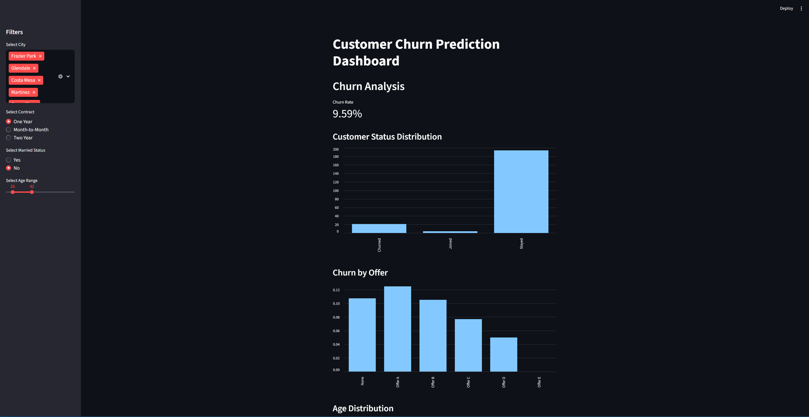

# Telco Churn Prediction Dashboard

A Python-based end-to-end project for predicting customer churn in the telecom domain. This project includes data preprocessing, machine learning model training, and an interactive Streamlit dashboard for real-time churn prediction.

## Overview

The dashboard allows users to input customer information and receive predictions on whether a customer is likely to churn. It also provides insights into key features affecting churn, helping businesses make informed decisions to retain customers.

## Features

- Data preprocessing and feature engineering for telecom customer data
- Machine learning model for churn prediction
- Interactive Streamlit dashboard for real-time predictions

## Dashboard Preview

